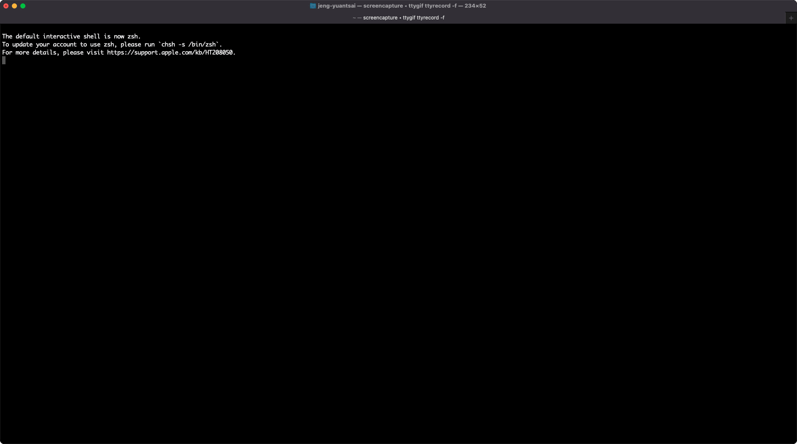

# BASH Commands Provider for Virtual Kubelet

This provider is a Virtual Kubelet that translates the commands from Kubernetes to the host shell commands. It is not running a container, but running shell commands on the host. This is based on the Virtual Kubelet (vk-mock) and is designed for running on various resources where a user can't reach the container runtime directly.

We modified the CreatePod in mock.go to run the shell commands. Users can specify the commands in the pod spec. The commands will be executed in the host shell. 

# Status of pod
- The status of the pod will be updated to `CmdSucceeded` and deleted when the commands are completed.

- The status of the pod will be updated to `CmdRunning` when the pod is created and the commands are ready to run.

- The status of the pod will be updated to `CmdFailed` when the commands do not successfully run. 
    - Note that if using pipeline to run commands on host from container (`echo "cmd on host" > pipeline`), the error from the command string ("cmd on host") will not be reflected here. It will still show `CmdSucceeded`. One has to check the `pipeline.out` for the error message.

# Docker image for virtual-kubelet-cmd
vk-cmd: https://github.com/vk-cmd

# Reference
This package is based on Virtual Kubelete - https://github.com/virtual-kubelet-cmd.

# Demo
